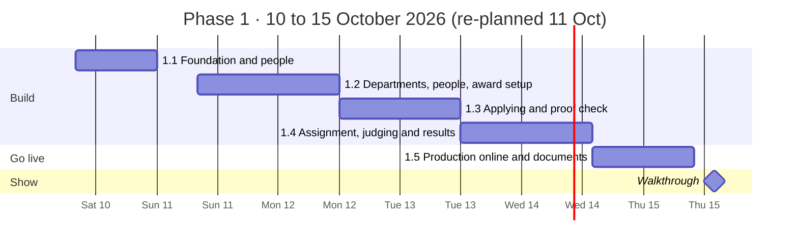
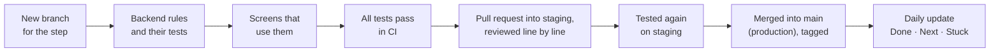

# Phase 1 roadmap: the working platform (10–15 October 2026)

> **What this page is.** How Phase 1 will be built: what we deliver, in what order, how each day is checked, and what the lead will see on Thursday. It takes about 10 minutes to read.
> The three-phase plan is in [PLAN.md](PLAN.md); the detailed working steps are in [PHASES.md](PHASES.md); the architecture and data model are in [TECHNICAL-DESIGN.md](TECHNICAL-DESIGN.md).
> **Re-planned on 11 Oct** around the lead's focus (building and filling forms, and judging), with people created on screen and no masking (ADRs 0017–0019).

---

## 1. The goal in one sentence

**Two awards that work in different ways run end to end on one platform, online. Staff set up their differences on screen without any code, and the four rules of the brief are enforced and tested.**

That is exactly what the brief asks for: *"one system handling two awards that work in different ways; a staff member sets those differences without changing any code."*

---

## 2. What we deliver on Thursday 15 October

| Deliverable | What it means |
|---|---|
| **A working platform online** | A public web address; a demo login for every role (leader, department head, staff, jury, applicant) |
| **An organiser set up on screen** | The leader creates a department and its head; the head creates their own staff and jury; each logs in and sees the department they work for |
| **Two different awards, set up on screen** | Built by staff in the browser, not in code; a third one is set up live during the walkthrough |
| **Forms and judging, done well** (the lead's focus) | A question builder with frozen versions; a form that saves itself and explains every mistake; jury assigned by hand with the counts in view; an exact average that can be checked with a calculator |
| **The four rules, enforced and tested** | Blind judging, conflicts of interest, score history, frozen question versions; automated tests run on every change |
| **The full journey of an award** | Setup → applications → proof check → assignment → several jury score → approval → published results |
| **The leader's dashboard** | One view across all awards and departments |
| **The brief's documents** | A README to run it from scratch, user journeys, an architecture drawing, what the tests check and don't, the AI mistake we caught, every decision with its reasons |

### The two demo awards

| | **Award A: Safety Excellence 2026** | **Award B: FPO Excellence Awards 2026** |
|---|---|---|
| Blind judging | **On**: jury never see the company, the applicant or any file | **Off** |
| Entry fee | **₹10,000** (demo payment) | **Free** |
| Categories | 1 | **4** |
| Jury per application | **2 to 3**; the average counts | **1** |
| Entry limit | None | **500**, shown publicly as "499 / 500" |
| Questions | 3 sections, text answers | 2 sections, with evidence uploads |
| Result | Shortlisted / Rejected | Shortlisted / Rejected |

**The difference between them is only settings.** Not one line of code mentions either award.

---

## 3. The timeline

From Sunday each step runs across two days, and Thursday morning is build time: about 71 hours in all, with **no buffer left**.

| Day | Date | Steps | By the end of the day you can see |
|---|---|---|---|
| 1 | **Sat 10 Oct** | 1.1 | Every role logs in; an applicant creates or joins a company; anyone can change their password |
| 2 | **Sun 11 Oct** | 1.2 | The leader creates a department and its head; the head creates staff and jury; each logs in with a temporary password, sets their own and sees their department |
| 3 | **Mon 12 Oct** | 1.2, 1.3 | Staff set up both awards on screen (questions, scoring sheet, award page) and publish them; an applicant starts filling a form |
| 4 | **Tue 13 Oct** | 1.3, 1.4 | Applicants submit to both awards; staff check the proof and assign the applications to jury |
| 5 | **Wed 14 Oct** | 1.4, 1.5 | Both awards run to published results with exact averages; the leader dashboard; production is online |
| — | **Thu 15 Oct** | 1.5 | Morning: demo data, documents, every role tested online. Afternoon: the walkthrough |
| | | **Total** | **~71 hours** (1.1 ≈ 15 · 1.2 ≈ 19 · 1.3 ≈ 14 · 1.4 ≈ 14 · 1.5 ≈ 9) |

---

## 4. How each step works

Every step follows the same routine, so progress is visible and nothing half-done reaches the main code.

- **The rules come before the screens.** Each rule is written and tested in the backend first, then the screen shows it. The screens hold no rules of their own.
- **Tests come with the code, not after.** The tests for the four rules are written from the brief's wording.
- **Each step merges when it's done**, at whatever hour: tested on the `staging` branch first, then merged into `main` (production), so `main` always works and the lead can open the repo at any moment.
- **[Daily.md](../Daily.md)** says what was done, what's next and what's stuck, every day.

---

## 5. Step by step

### Step 1.1 · Sat 10 Oct · Foundation and people (built)

**Why first:** everything else needs logins, roles and companies.

| Part | What we build |
|---|---|
| Backend base | The backend built on 6–7 Oct (62 tests), updated with the decisions of 7–9 Oct: proof fields, one application per company, several jury per application, no PA role |
| Logins and roles | Register, log in, log out; a secure session; each person's roles with their scope ("staff of this award", "jury of this department") |
| Two kinds of account | Applicants register their own account and only they apply; the leader, heads, staff and jury use platform accounts and never apply |
| My profile | Name, phone, change password (other devices get signed out). Applicants add their photo ID and LinkedIn link here, once |
| Companies | Create a company or join an existing one, with PAN and GSTIN checks. Values are cleaned on save (one PAN, one spelling) |
| Starter data | The leader, two departments (one is an outside organiser), their heads, staff, jury, the master lists, demo applicants |
| Web app | The app itself, login, a home page for each role, My profile, My organisation |

**Checked by:** 136 tests (a wrong password is refused; a password change signs out other devices; "abcde 1234f" joins the existing ABCDE1234F; the leader can't apply); logging in as each role by hand.

### Step 1.2 · Sun 11 – Mon 12 Oct · Departments, people and award setup

**Why now:** people must exist before they can set up awards, and award setup is the heart of the brief, "an award is settings, not code".

| Part | What we build |
|---|---|
| Departments | The leader creates a department (an external organiser or not, its colours) together with its head |
| People | The head adds staff and jury to the department. Each new person gets a temporary password, shown once to the creator; at first login they must set their own. A lost one can be replaced. Each person sees the departments they work for |
| Award settings | Create an award; dates, fee, categories (each can have its own fee), blind on or off, entry limit, how many jury per application, result names |
| Question builder | Sections and questions (short and long text, number, single choice, yes/no, file upload). Publishing **freezes** a version (rule 4) |
| Scoring sheet | Sections and indicators with whole-percent weights; the platform refuses weights that don't add up to 100% and offers "split evenly". The formula uses exact whole-number arithmetic |
| Publish check | An award can't go live with missing or invalid settings; staff see exactly what to fix |
| Award page and Open awards | Each award gets a public page in its department's logo and colours; dates, categories, fees and "499 / 500" fill in by themselves. Open awards lists them as branded cards |

**Checked by:** tests (only the leader creates a department; a head works only in their own; a temporary password works once and expires; an applicant can't be put on a jury list; rule 4: a published version can't be changed, also blocked by the database itself; weights; the formula against worked examples); creating a department with its people, then building Award B from scratch in the browser.

### Step 1.3 · Mon 12 – Tue 13 Oct · Applying and proof check

**Why now:** applications must exist before anyone can judge them. Filling the form is one of the lead's two focus areas.

| Part | What we build |
|---|---|
| Start | One application per company: once a colleague starts, nobody else in the company can (they see it read-only) |
| Fee | A demo payment for awards with a fee |
| The form | Every award's form shown from its settings; saves automatically while typing; a clear message next to any wrong answer; evidence uploads; in a blind award, a reminder not to name the company |
| Proof | A proof of employment dated within the last 3 months; the photo ID and LinkedIn come from My profile |
| Submit | Every required answer checked; the entry limit checked at the same moment, so the last place can't be taken twice |
| Deadline | At the deadline everything locks by itself; unfinished drafts become "Not submitted"; submitted applications are ready to assign |
| Staff | The applications list; the proof check (Verified, or Rejected with a reason) |

**Checked by:** tests (a second start by the same company is refused, even at the same second; each question type refuses a wrong answer; the 501st submission is refused; nothing can change after the deadline; last year's application opens with last year's questions); two browsers as two colleagues.

### Step 1.4 · Tue 13 – Wed 14 Oct · Assignment, judging and results

**Why now:** this is where rules 1, 2 and 3 live, and judging is the lead's other focus area.

| Part | What we build |
|---|---|
| Blind view (rule 1) | In a blind award the jury never get the company's details, the applicant's name or any file; they see the answers as typed. No masking step |
| Conflicts (rule 2) | Staff and the head record conflicts; a conflicted juror is blocked in every award |
| Assignment by hand | After the deadline, staff assign each application to one or more jury from the department's list. The board shows, per application, how many are assigned against the minimum and maximum ("needs 1 more"), and per juror, how many are assigned, submitted and pending |
| Scoring | Whole numbers 0–10 or Yes/No, an overall note, submit; each juror scores alone and never sees another's marks |
| The final score | The exact average of the submitted scores: whole-number points, rounded once to two decimals; equal scores share a rank. Staff see the numbers behind it, so it can be checked by hand |
| Score history (rule 3) | Any change after submission needs a reason; who, when, old and new value are kept |
| Approval | Staff send the round to the department head, who reviews the ranked list and approves; scores then lock forever |
| Results | Staff shortlist by rank or by a minimum score and publish; applicants see their result |
| Leader dashboard | Every award and department: applications, judging progress, rounds waiting for approval, deadlines |

**Checked by:** tests for each rule (a jury response is scanned for the company's name, PAN, GSTIN, email, address and the applicant's name; a conflicted assignment is refused even through the API; a score change without a reason is refused; nothing changes after approval), for assignment (never above the maximum, also when two staff assign at once) and for the average (three jury against a hand calculation); running Award A with two jury accounts by hand.

### Step 1.5 · Wed 14 – Thu 15 Oct (morning) · Online and documents

**Why this much time:** things that work on a laptop often break online (logins, files, database connections).

| Part | What we do |
|---|---|
| Online | The production site: the database and files on Supabase, the backend on Render, the screens on Vercel. (The staging site comes in Phase 2; `staging` is tested by CI and on a laptop) |
| Demo data | Both awards, the two departments with their people, about 20 companies, applications at different stages, one award already judged |
| Demo logins | One per role, shared privately with the lead |
| Documents | The README (run it from scratch in under 10 minutes), user journeys, the architecture drawing, what the tests check and don't, the AI notes, the walkthrough script |
| Final check | Every role online: create a department and its people, log in, upload, submit, assign, score, approve, publish |

### Thursday 15 Oct · The walkthrough

The morning finishes Step 1.5. The afternoon is the walkthrough (section 8).

---

## 6. How the four rules are proven

| Rule from the brief | How the platform keeps it | How we prove it |
|---|---|---|
| **1. Blind judging hides who applied** | In a blind award the jury view is built without the company's details, the applicant, team members, proof documents or files; the form asks applicants not to name their company | A test scans every jury response for the company's name, PAN, GSTIN, email and address and the applicant's name; a jury file download is refused |
| **2. No jury member with a conflict** | A recorded conflict is refused by the server for every award | A test assigns through the API directly, skipping the screen, and is refused |
| **3. Who changed a score, and why** | A change and its history entry are saved together, or not at all; approved rounds can't change | Tests: no reason, refused; a failing history write undoes the change; after approval, refused |
| **4. Last year's applications still read correctly** | Published questions are frozen; each application keeps its own version | Tests; the database itself refuses an edit to a published version |

**Known limit of rule 1:** a company name typed inside an answer does reach the jury. The form warns against it ([ADR 0018](decisions/0018-blind-judging-without-masking.md)).

---

## 7. What is not in Phase 1, on purpose

To fit the dates, these move to Phase 2. None of them is needed for the brief or the four rules.

| Moved to Phase 2 | In Phase 1 instead |
|---|---|
| On-site rounds (shop-floor competitions, live finals, medals) | Written rounds; the data model already includes on-site rounds |
| The full site builder (pages of sections, banner, about, contacts, versions) | One page per award in its department's logo and colours |
| Invitations by email | The leader or the head creates the account and passes on a temporary password |
| Other admin screens (master lists, company corrections, deactivation) | Created by the starter data, or fixed by us |
| The head sending a round back | The head approves |
| "New / Updated" markers and version comparison | Versions are still frozen and tested |
| Editing after submit, withdrawing | Submit when ready; staff can release a wrong application |
| The brand-kit screen, image uploads | Colours set when the department is created; logos from the starter data |
| The staging site online | `staging` tested by CI and on a laptop |
| Real emails | Every email is written to a log |

**Dropped at the lead's request:** masking (staff editing copies of answers and files to hide names). Blind awards hide identity automatically instead.

The full list, with reasons, is in [PLAN.md](PLAN.md#moved-to-phase-2-to-fit-the-dates).

---

## 8. The walkthrough on Thursday (about 20 minutes)

| Minutes | What we show |
|---|---|
| 0–2 | The goal and the two awards; the Open awards page and an award page |
| 2–5 | **An organiser set up live:** the leader creates a department and its head; the head adds a staff member and two jury; one logs in and sets their password |
| 5–8 | **Staff set up a third award live**, on screen, with no code: questions with a frozen version, a scoring sheet with weights |
| 8–11 | An applicant: company, profile, start (a colleague is blocked), the form with autosave, proof, submit; the counter moves |
| 11–12 | Staff: the proof check |
| 12–16 | Staff assign applications by hand, with the counts per application and per juror; two jury score the same application alone (blind: no company shown); the final score checked by hand; staff correct a score with a reason; the history shows it |
| 16–18 | The head approves; staff publish; the applicant sees the result; the leader dashboard |
| 18–20 | The tests for the four rules running; the repo: plan, decisions, daily log; questions |

---

## 9. Phase 1 is done when

- [ ] Both awards run end to end online, set up on screen with no code change
- [ ] A third award can be set up live in the walkthrough
- [ ] A department, its head, staff and jury can be created on screen, and each can log in
- [ ] All four rules are enforced on the server, with tests passing in CI
- [ ] Every role can log in online with a demo account
- [ ] A stranger can run it from the README in under 10 minutes
- [ ] The brief's documents are in the repository

---

## 10. Risks and what we do about them

| Risk | What we do |
|---|---|
| The build is tight (about 71 hours, and Thursday morning is now build time) | Each day has a finish line; if a day slips, it shows in Daily.md that day, and we cut from a short, agreed list |
| Something breaks only online | Wednesday afternoon and Thursday morning are kept for going online; only production goes online, and the hosting accounts are set up by Monday |
| A temporary password leaks on its way to the person | It works once, for 7 days at most, and must be changed at first login |
| The free server sleeps when idle | It is woken a few minutes before the walkthrough |
| No email provider yet | Emails are logged in Phase 1; real sending comes in Phase 2 |

**If a day still runs late, we cut in this order:** removing a person from a department → Open awards as branded cards (a plain list stays) → the filters on the staff applications list → the leader dashboard's panels (a table of counts stays). **Never cut:** the four rules and their tests, both awards on screen, people created on screen, the question builder with versions and the form with autosave, assignment by hand with the counts, several jury with the exact average, the proof check, one application per company, the entry limit, the leader dashboard, and going online.

---

## 11. What we need from the lead

| Need | By |
|---|---|
| Agreement on this re-planned Phase 1 (people on screen, no masking, the focus on forms and judging) | Sun 11 Oct |
| A time on Thursday afternoon for the walkthrough | Today |
| Whether to use personal or company accounts for Supabase, Render and Vercel | Monday |
| How the lead wants to follow progress: each pull request, or the daily update | Today |
