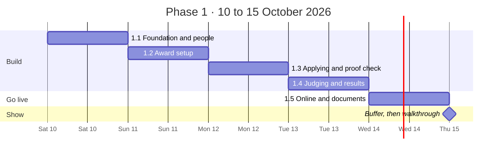
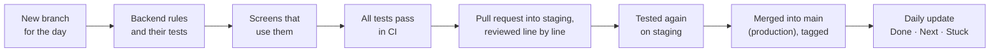

# Phase 1 roadmap: the working platform (10–15 October 2026)

> **What this page is.** How Phase 1 will be built: what we deliver, in what order, how each day is checked, and what the lead will see on Thursday. It takes about 10 minutes to read.
> The three-phase plan is in [PLAN.md](PLAN.md); the detailed working steps are in [PHASES.md](PHASES.md); the architecture and data model are in [TECHNICAL-DESIGN.md](TECHNICAL-DESIGN.md).

---

## 1. The goal in one sentence

**Two awards that work in different ways run end to end on one platform, online. Staff set up their differences on screen without any code, and the four rules of the brief are enforced and tested.**

That is exactly what the brief asks for: *"one system handling two awards that work in different ways; a staff member sets those differences without changing any code."*

---

## 2. What we deliver on Thursday 15 October

| Deliverable | What it means |
|---|---|
| **A working platform online** | A public web address; a demo login for every role (leader, department head, staff, jury, applicant) |
| **Two different awards, set up on screen** | Built by staff in the browser, not in code; a third one is set up live during the walkthrough |
| **The four rules, enforced and tested** | Blind judging, conflicts of interest, score history, frozen question versions; automated tests run on every change |
| **The full journey of an award** | Setup → applications → proof check → masking → several jury score → approval → published results |
| **The leader's dashboard** | One view across all awards and departments |
| **The brief's documents** | A README to run it from scratch, user journeys, an architecture drawing, what the tests check and don't, the AI mistake we caught, every decision with its reasons |

### The two demo awards

| | **Award A: Safety Excellence 2026** | **Award B: FPO Excellence Awards 2026** |
|---|---|---|
| Blind judging | **On**: jury see answers with the company's name hidden | **Off** |
| Entry fee | **₹10,000** (demo payment) | **Free** |
| Categories | 1 | **4** |
| Jury per application | **2 to 3**; the average counts | **1** |
| Entry limit | None | **500**, shown publicly as "499 / 500" |
| Questions | 3 sections, text answers | 2 sections, with evidence uploads |
| Result | Shortlisted / Rejected | Shortlisted / Rejected |

**The difference between them is only settings.** Not one line of code mentions either award.

---

## 3. The timeline

| Day | Date | Step | Hours | By the end of the day you can see |
|---|---|---|---|---|
| 1 | **Sat 10 Oct** | Foundation and people | ~15 | Every role logs in; an applicant creates or joins a company; anyone can change their password |
| 2 | **Sun 11 Oct** | Award setup | ~13 | Staff set up both awards on screen and publish them; they appear on the public Open awards page |
| 3 | **Mon 12 Oct** | Applying and proof check | ~14 | An applicant submits to both awards; staff check the proof; the counter shows "1 / 500" |
| 4 | **Tue 13 Oct** | Judging and results | ~17 | Both awards run all the way to published results; the leader dashboard shows them |
| 5 | **Wed 14 Oct** | Online and documents | ~12 | The platform runs at a public address with demo data |
| — | **Thu 15 Oct** | Buffer, then the walkthrough | — | The morning catches anything late; the walkthrough is in the afternoon |
| | | **Total** | **~71 hours** | |

---

## 4. How each day works

Every day follows the same routine, so progress is visible and nothing half-done reaches the main code.

- **The rules come before the screens.** Each rule is written and tested in the backend first, then the screen shows it. The screens hold no rules of their own.
- **Tests come with the code, not after.** The tests for the four rules are written from the brief's wording.
- **Every day ends merged.** Each step is tested on the `staging` branch first, then merged into `main` (production), so `main` always works and the lead can open the repo at any moment.
- **[Daily.md](../Daily.md)** says what was done, what's next and what's stuck, every day.

---

## 5. Day by day

### Day 1 · Sat 10 Oct · Foundation and people

**Why first:** everything else needs logins, roles and companies.

| Part | What we build |
|---|---|
| Backend base | The backend built on 6–7 Oct (62 tests) joins `main`, updated with the decisions of 7–9 Oct: proof fields, one application per company, several jury per application, no PA role |
| Logins and roles | Register, log in, log out; a secure session; each person's roles with their scope ("staff of this award", "jury of this cycle") |
| My profile | Name, phone, change password (other devices get signed out). Applicants add their photo ID and LinkedIn link here, once |
| Companies | Create a company or join an existing one, with PAN and GSTIN checks. Values are cleaned on save (one PAN, one spelling) |
| Starter data | The leader, two departments (one is an outside organiser), their heads, staff, jury, the master lists, demo applicants |
| Web app | The app itself, login, a home page for each role, My profile, My organisation |

**Checked by:** tests (a wrong password is refused; a password change signs out other devices; "abcde 1234f" joins the existing ABCDE1234F); logging in as each role by hand.

### Day 2 · Sun 11 Oct · Award setup

**Why now:** the heart of the brief, "an award is settings, not code".

| Part | What we build |
|---|---|
| Award settings | Create an award; dates, fee, categories (each can have its own fee), blind on or off, entry limit, how many jury per application, result names |
| Question builder | Sections and questions (short and long text, number, single choice, yes/no, file upload). Publishing **freezes** a version (rule 4) |
| Scoring sheet | Indicators with weights; the platform refuses weights that don't add up to 100%; the score formula and the average |
| Publish check | An award can't go live with missing or invalid settings; staff see exactly what to fix |
| Branded award page | Each award gets a public page in its department's brand; the deadline, categories, fees and "499 / 500" fill in by themselves |
| Open awards | The public list of open awards as branded cards |

**Checked by:** tests for rule 4 (a published version can't be changed, also blocked by the database itself), weights, the score formula against a worked example; building Award B from scratch in the browser.

### Day 3 · Mon 12 Oct · Applying and proof check

**Why now:** applications must exist before anyone can judge them.

| Part | What we build |
|---|---|
| Start | One application per company: once a colleague starts, nobody else in the company can (they see it read-only) |
| Fee | A demo payment for awards with a fee |
| The form | Every award's form shown from its settings; saves automatically while typing; evidence uploads |
| Proof | A proof of employment dated within the last 3 months; the photo ID and LinkedIn come from My profile |
| Submit | Every required answer checked; the entry limit checked at the same moment, so the last place can't be taken twice |
| Deadline | At the deadline everything locks by itself; unfinished drafts become "Not submitted" |
| Staff | The applications list; the proof check (Verified, or Rejected with a reason) |

**Checked by:** tests (a second start by the same company is refused, even at the same second; the 501st submission is refused; nothing can change after the deadline; last year's application opens with last year's questions); two browsers as two colleagues.

### Day 4 · Tue 13 Oct · Judging and results

**Why now:** this is where rules 1, 2 and 3 live.

| Part | What we build |
|---|---|
| Masking (rule 1) | In a blind award, staff make a copy of the answers with names hidden; jury only ever see that copy |
| Jury and conflicts (rule 2) | Staff and the head choose the jury; recorded conflicts block that jury member in every award |
| Several jury | Staff set a minimum and maximum per application; each application gets that many jury; each scores alone |
| Scoring | Whole numbers 0–10 or Yes/No, an overall note, submit; the final score is the average |
| Score history (rule 3) | Any change after submission needs a reason; who, when, old and new value are kept |
| Approval | Staff send the round to the department head, who reviews the ranked list and approves; scores then lock forever |
| Results | Staff shortlist by score and publish; applicants see their result |
| Leader dashboard | Every award and department: applications, judging progress, rounds waiting for approval, deadlines |

**Checked by:** tests for each rule (a jury response is scanned for the company's name, PAN and GSTIN; a conflicted assignment is refused even through the API; a score change without a reason is refused; nothing changes after approval); running Award A with two jury accounts by hand.

### Day 5 · Wed 14 Oct · Online and documents

**Why a whole day:** things that work on a laptop often break online (logins, files, database connections).

| Part | What we do |
|---|---|
| Online | The database and files on Supabase, the backend on Render, the screens on Vercel: a staging site for testing and the production site for the lead |
| Demo data | Both awards, about 20 companies, applications at different stages, one award already judged |
| Demo logins | One per role, shared privately with the lead |
| Documents | The README (run it from scratch in under 10 minutes), user journeys, the architecture drawing, what the tests check and don't, the AI notes, the walkthrough script |
| Final check | Every role online: log in, upload, submit, score, approve, publish |

### Thursday 15 Oct · Buffer, then the walkthrough

The morning absorbs anything that slipped. The afternoon is the walkthrough (section 8).

---

## 6. How the four rules are proven

| Rule from the brief | How the platform keeps it | How we prove it |
|---|---|---|
| **1. Blind judging hides who applied** | Jury only ever receive the masked answers; never the company, its files or its proof documents | A test scans every jury response for the company's name, PAN, GSTIN, email and address |
| **2. No jury member with a conflict** | A recorded conflict is refused by the server for every award | A test assigns through the API directly, skipping the screen, and is refused |
| **3. Who changed a score, and why** | A change and its history entry are saved together, or not at all; approved rounds can't change | Tests: no reason, refused; a failing history write undoes the change; after approval, refused |
| **4. Last year's applications still read correctly** | Published questions are frozen; each application keeps its own version | Tests; the database itself refuses an edit to a published version |

---

## 7. What is not in Phase 1, on purpose

To fit the dates, these move to Phase 2. None of them is needed for the brief or the four rules.

| Moved to Phase 2 | In Phase 1 instead |
|---|---|
| On-site rounds (shop-floor competitions, live finals, medals) | Written rounds; the data model already includes on-site rounds |
| The full site builder (pages of sections, versions) | One branded page per award |
| Leader admin screens (departments, people, master lists) | Created by the starter data |
| The head sending a round back | The head approves |
| Masking of uploaded files | Masking of answers; the blind award has text answers only |
| "New / Updated" markers and version comparison | Versions are still frozen and tested |
| Editing after submit, withdrawing | Submit when ready; staff can release a wrong application |
| The brand-kit screen, image uploads | Logos and colours from the starter data |
| Real emails | Every email is written to a log |

The full list, with reasons, is in [PLAN.md](PLAN.md#moved-to-phase-2-to-fit-the-dates).

---

## 8. The walkthrough on Thursday (about 20 minutes)

| Minutes | What we show |
|---|---|
| 0–2 | The goal and the two awards; the open awards page and a branded award page |
| 2–6 | **Staff set up a third award live**, on screen, with no code |
| 6–9 | An applicant: company, profile, start (a colleague is blocked), form, proof, submit; the counter moves |
| 9–11 | Staff: proof check; masking in the blind award |
| 11–15 | Jury: two jury members score the same application alone; staff correct a score with a reason; the history shows it |
| 15–17 | The head approves; staff publish; the applicant sees the result; the leader dashboard |
| 17–20 | The tests for the four rules running; the repo: plan, decisions, daily log; questions |

---

## 9. Phase 1 is done when

- [ ] Both awards run end to end online, set up on screen with no code change
- [ ] A third award can be set up live in the walkthrough
- [ ] All four rules are enforced on the server, with tests passing in CI
- [ ] Every role can log in online with a demo account
- [ ] A stranger can run it from the README in under 10 minutes
- [ ] The brief's documents are in the repository

---

## 10. Risks and what we do about them

| Risk | What we do |
|---|---|
| Four build days are tight (about 71 hours) | The scope is already trimmed; each day has a finish line; Thursday morning is a buffer; if a day slips, it shows in Daily.md that day, and we cut from a short, agreed list |
| Something breaks only online | Wednesday is reserved for deployment; the hosting accounts are set up by Monday; a staging site catches problems before production |
| The free server sleeps when idle | It is woken a few minutes before the walkthrough |
| No email provider yet | Emails are logged in Phase 1; real sending comes in Phase 2 |

**If a day still runs late, we cut in this order:** joining a company on screen (creating stays) → the award page's banner and contacts → scoring-sheet sections. **Never cut:** the four rules and their tests, both awards on screen, several jury with the average, masking of answers, the proof check, one application per company, the entry limit, the leader dashboard, and going online.

---

## 11. What we need from the lead

| Need | By |
|---|---|
| Agreement on this Phase 1 scope and the moved items | Today |
| A time on Thursday afternoon for the walkthrough | Today |
| Whether to use personal or company accounts for Supabase, Render and Vercel | Monday |
| How the lead wants to follow progress: each pull request, or the daily update | Today |
