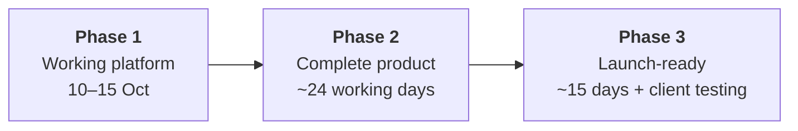

# Delivery plan: three phases

> **For the lead and reviewers.** This page is the whole plan in plain words, from start to finish. It takes 5 minutes to read.
> Agreed on 9 Oct 2026 after the lead call. Phase 1 starts **Saturday 10 October**.
> **Phase 1, day by day, for presenting:** [PHASE-1-ROADMAP.md](PHASE-1-ROADMAP.md). The detailed working steps are in [PHASES.md](PHASES.md), the technical design in [TECHNICAL-DESIGN.md](TECHNICAL-DESIGN.md), and live status in [PROGRESS.md](PROGRESS.md).

## The three phases at a glance

| Phase | What it delivers | When | Effort |
|---|---|---|---|
| **1. Working platform** (what we are judged on) | Two awards that work differently run **end to end, online**. Staff set them up on screen with **no code**. The **four rules** are enforced and tested. | **Sat 10 – Thu 15 Oct 2026** | 5 working days (about 71 hours) |
| **2. Complete product** | Everything else the client asked for: on-site rounds and medals, the full site builder, the leader's admin screens, all emails, end-to-end tests | About **24 working days** after Phase 1 | ~24 days |
| **3. Launch-ready** | What a real launch needs: security and privacy review, load testing, a real payment gateway, own domains, client testing | About **15 working days**, plus client testing | ~15 days + 5–10 days of client testing |

Each phase ends with something the client can open and use. Nothing built in Phase 1 is thrown away: it is the real architecture, and Phases 2 and 3 add to it.

---

## Phase 1: the working platform (10–15 October)

### The goal

Exactly what the brief asks, done properly: *"one system handling two awards that work in different ways; a staff member sets those differences without changing any code"*, with the four rules enforced and tested. It is **deployed online**, so anyone can try it.

### The two awards in the demo

| | Award A: Safety Excellence Award 2026 | Award B: FPO Excellence Awards 2026 |
|---|---|---|
| Blind judging | **On**: jury see a copy with the company's name hidden | **Off** |
| Entry fee | **₹10,000** (demo payment) | **Free** |
| Categories | 1 | **4** |
| Jury per application | **2 to 3**; the average counts | **1** |
| Entry limit | None | **500**, shown as "499 / 500" |
| Questions | 3 sections, text answers only | 2 sections, with evidence uploads |

Both are set up **on screen by staff**. In the walkthrough, staff also set up a third award live, to show that no developer is needed.

### What works in Phase 1

| Who | What they can do |
|---|---|
| **Visitor** | See open awards as branded cards, and each award's branded page (logo, colours, banner, about, categories, deadline, places left) |
| **Applicant** | Register, then create or join their company (PAN and GSTIN checked and cleaned). Add a photo ID and LinkedIn link once, on **My profile**. Start an application (blocked if a colleague already did), pay the demo fee, fill the form with autosave, upload evidence and a recent proof of employment, then submit, and see their status and result. Change their password |
| **Staff** | Create an award and set it up: dates, fee, blind, categories, entry limit, jury per application, questions (with versions) and the scoring sheet (weights must total 100%). Fill in the award's branded page. Check proof, hide names in the answers (blind awards), choose jury and record conflicts, assign several jury per application, follow progress, correct a score with a reason, send for approval, then shortlist and publish results |
| **Jury** | See their applications, score them (whole numbers 0–10 or Yes/No) with an overall note, and submit. In a blind award they only see the masked copy |
| **Department head** | Add jury to the pool. Review the ranked results and approve the round |
| **Leader** (and the leader's team, on the same account) | A read-only dashboard across all awards and departments: applications, judging progress, rounds waiting for approval, deadlines |

### How the four rules are proven

| Rule | In Phase 1 | Proof |
|---|---|---|
| 1. Blind judging | Jury only ever get the masked answers, never the company, its files or its documents | Automated tests scan every jury response for the company's name, PAN and GSTIN |
| 2. Conflicts of interest | A recorded conflict blocks that jury member, for every award | A test tries to assign through the API directly and is refused |
| 3. Score history | Every change after submission needs a reason; who, when, old and new are kept | Tests; the history shows on the application page |
| 4. Question versions | Published questions are frozen; old applications open with their own version | Tests; the database itself refuses edits |

### Day by day

| Day | Date | Build | By the end of the day you can see |
|---|---|---|---|
| 1 | **Sat 10 Oct** | **Foundation and people.** Finish the backend base (the parked code plus the 7–9 Oct changes), logins and roles, My profile, companies, starter data. The web app with login and role areas | Log in as every role; create or join a company; change your password |
| 2 | **Sun 11 Oct** | **Award setup.** Awards, settings, the question builder with versions, the scoring sheet with weights, the branded award page, the Open awards page | Staff set up both awards on screen and publish them; they appear on Open awards |
| 3 | **Mon 12 Oct** | **Applying.** Start (one per company), demo fee, the form with autosave, uploads, proof of employment, submit with the entry limit, the deadline lock. Staff: applications list, proof check | An applicant submits to both awards; staff verify the proof |
| 4 | **Tue 13 Oct** | **Judging and results.** Masking of answers, jury pool and conflicts, several jury per application, scoring, score changes with reasons, approval, results, the leader dashboard. All rule tests green | Both awards run from application to published results |
| 5 | **Wed 14 Oct** | **Online and polished.** Deploy (Supabase, Render, Vercel), load the demo data, test every role online, finish the README and documents, rehearse | The platform runs at a public address |
| — | **Thu 15 Oct** | Morning: buffer for anything late. **Afternoon: walkthrough with the lead** | — |

Every day ends with its work tested and merged, and a short update in [Daily.md](../Daily.md).

### Kept simple in Phase 1, on purpose

- **Departments, heads and staff are created by the starter data.** Their admin screens come in Phase 2. Staff still create and set up awards on screen, which is what the brief tests.
- **A branded page per award, filled in on a form.** The full drag-and-arrange site builder comes in Phase 2.
- **Emails** are written to an email log, and caught locally by a test mailbox. Real sending online needs an email provider, chosen in Phase 2.
- **The payment is a demo**; there are no real payments until Phase 3.
- **Written rounds only.** On-site rounds (shop-floor competitions, live finals, medals) come in Phase 2. The data model already includes them.

### Moved to Phase 2 to fit the dates

On 10 Oct the full Phase 1 list came to about 100 hours of work against about 64 available. These items move to Phase 2 (package 2.5 unless noted). None of them is needed for the brief or the four rules:

| Moved | Why it can wait |
|---|---|
| Send back with a remark, and reopening a jury member's scores | The head can still approve; the full loop comes next |
| Masking of uploaded **files** (masking of answers stays) | In Phase 1 the blind award has text answers only, so nothing is exposed |
| Comparing question versions and "New / Updated" markers | Versions are still frozen and tested (rule 4) |
| Editing a submitted application ("Save changes") and withdrawing | Applicants submit when ready; staff can release a wrong application |
| A screen for releasing an application | The release works through the API, with its test |
| The full scoring-sheet builder; date, multi-choice and team-member questions | A simpler builder and six question types cover both demo awards |
| The brand-kit screen and image uploads on award pages (2.2) | Logos and colours come from the starter data |
| Inviting a new juror by email (2.3) | Jury are picked from existing accounts |
| The applicant's status timeline | The status and result still show |
| Edge-case tests beyond the four rules and the main flows (2.8) | Every rule keeps its tests |

That brings Phase 1 to **about 71 hours**: 12–13 hour days, Sunday included, with Thursday morning kept as a buffer.

### If a day still runs late

We cut from the top, and never the core:

1. joining an existing company on screen (creating one stays; joining works through the API);
2. the award page's banner and contacts (logo, colours, deadline and counter stay);
3. the scoring sheet's sections (one section with weighted indicators stays).

**Never cut:** the four rules and their tests, two awards configured on screen, several jury with the average, masking of answers, the proof check, one application per company, the entry limit, the leader dashboard, and the online deployment.

### Phase 1 is done when

- [ ] Both awards run end to end online, set up on screen with no code change
- [ ] A third award can be set up live in the walkthrough
- [ ] All four rules are enforced on the server, with tests passing in CI
- [ ] Every role can log in online with a demo account
- [ ] A stranger can run it from the README in under 10 minutes
- [ ] The brief's documents are in the repository: user journeys, an architecture drawing, what the tests check and don't, the AI mistake we caught, and the decisions

---

## Phase 2: the complete product (about 24 working days)

| # | Work | Days | What it adds |
|---|---|---|---|
| 2.1 | **On-site rounds** | 4 | Shop-floor competitions (Kaizen, 5S) and live finals: time slots, panels of 2–5, scoring on a phone, average, close the round, Gold / Silver / Bronze. A third award type |
| 2.2 | **Full site builder** | 5 | Pages made of ready-made sections (gallery, past winners, FAQ, partners…), layouts, a phone preview, saved versions and restore; the brand-kit screen and image uploads |
| 2.3 | **Leader's admin screens** | 3 | Create departments and external organisers, appoint heads, assign staff to awards, master lists, company corrections, deactivating accounts |
| 2.4 | **Department dashboard** | 1 | External organisers run their awards from their own dashboard |
| 2.5 | **Applying and judging extras** | 4 | Send back and reopen scores; masking of files; version comparison and "New / Updated" markers; editing after submit and withdrawing; the release screen; the full scoring-sheet builder and more question types; disqualify and reinstate; deadline extension; "questions changed" alerts; a flag when jury disagree widely; the applicant's status timeline |
| 2.6 | **Emails** | 1 | Every email template, sent for real through an email provider |
| 2.7 | **Privacy housekeeping** | 1 | Automatic deletion of proof documents after 12 months |
| 2.8 | **End-to-end and edge-case tests** | 3 | Robot tests that click through every user's journey in a browser, and the edge cases Phase 1 skipped |
| 2.9 | **Review and buffer** | 2 | Fixes from the client's feedback on Phase 1 |
| | **Total** | **24** | |

## Phase 3: launch-ready (about 15 working days, plus client testing)

| # | Work | Days | What it adds |
|---|---|---|---|
| 3.1 | **Security review** | 3 | An outside-in check of every permission, the database locked down, a penetration test |
| 3.2 | **Privacy review** | 2 | India's DPDP Act: consent, minimum data, retention, with the client's legal team |
| 3.3 | **Load and speed** | 2 | Hundreds of applicants online the night before a deadline |
| 3.4 | **Accessibility** | 2 | Keyboard use, screen readers, contrast |
| 3.5 | **Real payments** | 3 | A payment gateway and receipts, for awards with fees |
| 3.6 | **Own web addresses** | 1 | `fpo.<platform>` first, then the organiser's own domain |
| 3.7 | **Backups and monitoring** | 1 | Alerts, backups, a runbook for staff |
| 3.8 | **Nice extras** | 1 | Copy last year's setup, reports as CSV, reminders to jury and heads |
| 3.9 | **Client testing** | 5–10 | The client's staff try real awards; we fix what they find |

**Total, all three phases:** about 44 working days for one developer, plus client testing. With two developers, Phases 2 and 3 take about half the time.

---

## Why this order

- **Phase 1 proves the hard parts first.** One engine runs different awards, set up without code, with fair, auditable judging. Everything else builds on that.
- **What's most visible to applicants comes early**: branded pages, a simple form, one profile reused everywhere.
- **What's rare or big comes later**: on-site days happen once or twice a year, and the full site builder is a large feature on its own.
- **Launch work comes last**, when the features have stopped moving.

## What the walkthrough will show

- **A third award set up live**, in a few minutes, with no code.
- **Tests for each rule.** Each of the four rules has named tests that run on every change; `docs/testing.md` lists them.
- **Clean company data.** Company details are cleaned when saved (one PAN, one spelling), so the leader's dashboard counts each company once.
- **Fair judging.** Several jury per application, averaged; jury never see each other's marks; every score change has a reason.
- **Room to grow.** One database for all awards, with every row tied to its award. About 40,000 applications a year fits, and Phases 2 and 3 add features without rebuilding.
- **Online, with a demo login for every role**, so the lead can try it alone.

## Risks we are watching

| Risk | What we do |
|---|---|
| Four build days are tight (about 71 hours of work) | The scope was trimmed on 10 Oct; each day has a clear finish line; Thursday morning is a buffer; the cut list protects the core |
| The free server sleeps after 15 minutes idle | Wake it before the demo; consider a small paid plan for demo week |
| Something only breaks online | Day 5 is kept for deployment and fixes |
| No email provider chosen yet | Emails are logged in Phase 1; real sending in Phase 2 |

## Open questions for the lead (none of them blocks Phase 1)

1. Should a written-review-only award say "Shortlisted" or "Winner" at the end? (Renamable; default "Shortlisted".)
2. Which email address or domain should the platform send from? (Needed for Phase 2.)
3. Should past years' data be imported later? (Not planned.)
