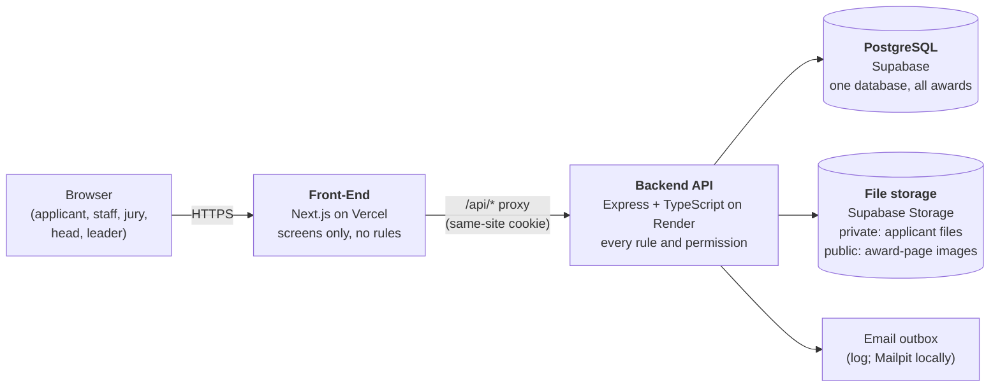
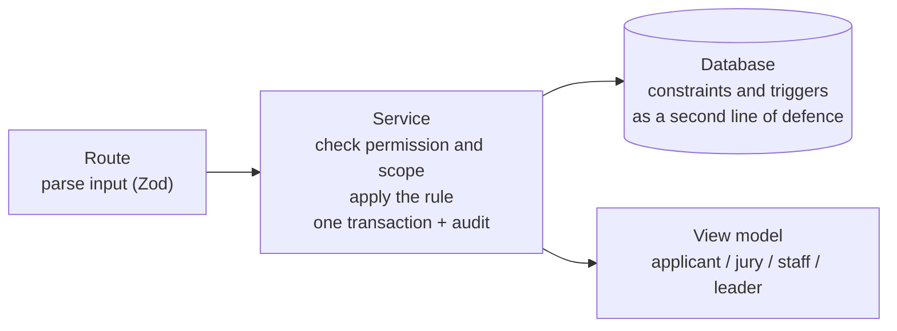
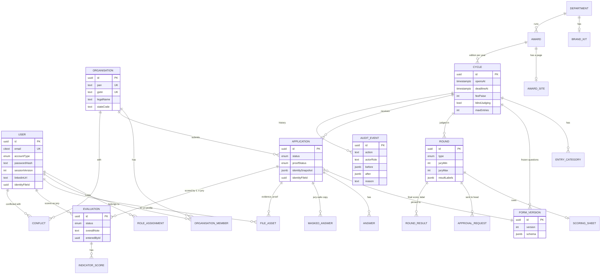
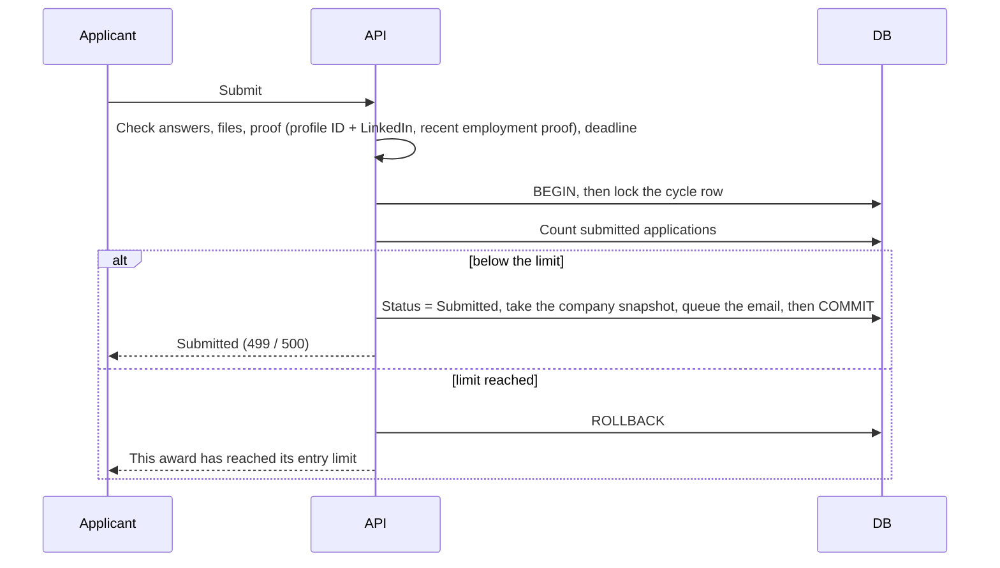

# Technical design

> **The technical part agreed before coding** (lead, 9 Oct 2026): how the system is built, the data model, the main flows, the API for Phase 1, and how it scales. The full field-by-field model is in [requirements.md §10](requirements.md#10-data-model); the decisions behind it are in [decisions/](decisions/). The plan is in [PLAN.md](PLAN.md).

## 1. Architecture

- **Two apps, one source of truth.** The frontend only shows what the API decides. The API is the only thing that touches the database ([ADR 0001](decisions/0001-frontend-backend-split-and-hosting.md)).
- **Login:** our own email-and-password login in the API. A signed session cookie passes through the frontend's `/api` proxy, so browsers treat it as first-party ([ADR 0003](decisions/0003-authentication-and-sessions.md)).
- **A modular monolith.** One API, split into modules. Each module owns its routes, service, permission checks and views, so a module could be split out later if a real need appeared.

### Inside the API: one request

- Routes never touch the database; services know nothing about HTTP.
- Every service function takes the **acting user first** and checks their role **and scope**, for example "staff of this award" or "jury of this cycle".
- Raw database rows never leave the API. Each role gets its own view. In a blind award the jury view is built **only** from the masked copy.

### Modules

| Module | Phase 1 | Phase 2 |
|---|---|---|
| identity (login, roles, My profile, password) | ✅ | invites from admin screens, deactivation |
| organisations (create, join, normalise) | ✅ | corrections by the leader |
| master-data (award domains, organisation types) | read; lists seeded | admin screens |
| departments (brand kit) | departments and brand kits seeded | create departments, appoint heads, brand-kit screen |
| awards, forms (versions), scoring (weights, formula) | ✅ | copy last year's setup (Phase 3) |
| sites | one branded page per award | full section builder, versions |
| applications (start, fee, answers, files, proof, submit, release) | ✅ | edit after submit, withdraw, deadline extension, "questions changed" alerts |
| masking (answers), jury-pool (conflicts), judging (several jury, scores, audit) | ✅ | masking of files, disqualify and reinstate, reopen |
| approval (approve), results | ✅ | send back |
| reporting | leader dashboard | department dashboard |
| onsite | tables only | ✅ slots, panels, close, medals |
| audit, notifications | ✅ (outbox, log) | real email provider |

## 2. Data model

**One set of tables for all awards.** Every award-related row is tied to its **cycle** (one edition of an award), and foreign keys include the cycle, so rows from two awards can never mix. A new award adds rows, never a new table. The whole model, including the Phase 2 tables, is created in Phase 1, so later phases add features without reshaping the data.

### What the database itself guarantees

The services check everything first, with friendly errors. The database refuses bad data even if a service had a bug.

| Guarantee | How |
|---|---|
| One record per company, person, department (ignoring letter case) | Unique PAN; `citext` for emails and names |
| Awards never mix | Foreign keys that include the cycle |
| One active application per company per award | Partial unique index (Withdrawn and Released don't count) |
| A jury member gets an application only once | Partial unique index on active evaluations |
| History can't be edited | Triggers refuse UPDATE and DELETE on audit events, form versions, published page versions and disqualification history |
| Valid values | CHECKs: PAN and GSTIN format, scores 0–10, jury minimum ≤ maximum, file owner rules, money in whole paise |
| Exactly one leader | Partial unique index |
| Applicants and the platform's people never mix | `accountType` on every user (ADR 0016): triggers refuse a role or an evaluation for an applicant account, and an organisation, an application or an identity document for a platform account |

### Where each award's differences live (all data, no code)

| Difference | Stored in |
|---|---|
| Dates, fee, blind judging, entry limit | `Cycle` |
| Categories and their fees | `EntryCategory` |
| Questions | `FormVersion.schema` (frozen JSON per publish) |
| Indicators and weights | `ScoringSheet.schema` per round |
| Rounds, jury per application, result labels | `Round` |
| Brand and award page | `BrandKit`, `AwardSite`, `SitePage` |

## 3. Key flows

**Submit with the entry limit**: the last place can't be taken twice.

**Assign several jury**: never above the maximum, never a conflict.
1. Staff choose applications and one or more jury members.
2. In one transaction: lock each application, count its active jury, and check the maximum, recorded conflicts, verified proof and masking.
3. All or nothing: if any check fails, nothing is assigned, and staff see why.

**Change a score after submission (rule 3).** In one transaction, the score is updated and an audit event is written with who, when, old value, new value and reason. If either fails, both are undone. After approval, every change is refused.

**Final score.** Each jury member's score comes from the formula in spec §5.5. The application's final score is the average of the submitted scores, rounded to 2 decimals once, at the end.

## 4. API for Phase 1 (summary)

All routes live under `/api` and return view models. The full contract grows in `docs/API.md` as each step lands.

| Area | Main endpoints |
|---|---|
| Auth and profile | `POST /auth/register`, `/auth/login`, `/auth/logout`; `GET /me`; `PATCH /me/profile`; `POST /me/password`; `PUT /me/linkedin`; `POST /me/identity-document/uploads` (an upload link), then `PUT /me/identity-document` |
| Master data (public) | `GET /master-data/organisation-types`, `/master-data/award-domains`, `/master-data/states` |
| Organisations | `POST /organisations`, `POST /organisations/join`, `GET /organisations/mine`, `PATCH /organisations/:id` |
| Public | `GET /public/awards` (open awards), `GET /public/awards/:slug` (branded page, live counter) |
| Award setup (staff) | `POST /awards`, `POST /awards/:id/cycles`, `PATCH /cycles/:id`, `PUT /cycles/:id/form-draft`, `POST /cycles/:id/form-versions`, `PUT /rounds/:id/scoring-sheet`, `PATCH /rounds/:id` (jury per application), `POST /cycles/:id/publish`, `PUT /awards/:id/site` |
| Brand (head, staff) | `PUT /departments/:id/brand-kit` |
| Applying | `POST /cycles/:id/applications`, `POST /applications/:id/payment`, `PUT /applications/:id/answers`, `POST /applications/:id/files`, `POST /applications/:id/employment-proof`, `POST /applications/:id/submit`, `GET /applications/mine` |
| Staff checks | `GET /cycles/:id/applications`, `POST /applications/:id/proof-check`, `POST /applications/:id/release`, masking: `PUT /applications/:id/masked-answers`, `POST /applications/:id/masking-done` |
| Jury and judging | `POST /cycles/:id/jury-pool`, `POST /conflicts`, `POST /rounds/:id/assignments`, `GET /jury/evaluations`, `PUT /evaluations/:id/scores`, `POST /evaluations/:id/submit`, `POST /evaluations/:id/score-changes` |
| Approval and results | `POST /rounds/:id/send-for-approval`, `POST /approvals/:id/approve`, `PUT /rounds/:id/results`, `POST /rounds/:id/publish-results` |
| Leader | `GET /reports/leader-dashboard`; `GET /applications/:id/history` |
| Files | `GET /files/:id` (checks who may read which kind, then answers with a short-lived signed link). Uploads get a signed link from the endpoint that owns the file, for example `PUT /me/identity-document` |

## 5. How it scales

| Concern | Design |
|---|---|
| **Volume** | About 80 awards × 300–500 applications = up to **40,000 applications a year**. The largest award: 500 × 250 indicators = about 125,000 scores per round. Small for one PostgreSQL database |
| **Deadline peaks** | A stateless API (sessions in a signed cookie, not in server memory), so more API instances can be added; Supabase's connection pooler for the app, a direct connection for migrations |
| **Fast lists** | Indexes on (cycle, status), (cycle, organisation), (jury, status) and the audit (cycle, entity); lists are paged |
| **Big files** | Files go to object storage, never into the database; uploads are limited by type and size (10 MB) |
| **Emails** | An outbox table written in the same transaction; sent in batches after commit, so a slow mail server never slows a request |
| **New awards** | Rows, not tables or code: an 81st award costs nothing to add |
| **Later growth** | Module boundaries allow splitting a module out; row-level security can be added as a second safety net; an "organisation level" above awards would allow other client bodies (multi-tenancy) |

## 6. Security and privacy

- Passwords hashed with bcrypt. Changing a password signs out every other device (`sessionVersion`).
- Every input is checked with Zod; every permission is checked in the service, never only on screen.
- Supabase's automatic table API is locked down, so tables can't be read around our API (G-B04, checked on deployment day).
- Applicant files sit in a **private** bucket. The API checks who may upload or read a file, then issues a short-lived signed link, so file bytes never pass through Vercel or Render (G-B03). Award-page images sit in a separate **public** bucket.
- Proof documents are never in any jury response, and are deleted 12 months after results (the automatic clean-up comes in Phase 2).
- Secrets live only in environment variables; `.env.example` lists the names.
- API responses send `Cache-Control: no-store` unless they are public award pages, because Vercel caches proxied responses that carry caching headers (G-B16).

## 7. Environments

| Where | Database | Used for |
|---|---|---|
| Laptop | PostgreSQL in Docker (`awards`), Mailpit | Development |
| Laptop and CI | `awards_test`, or a fresh database in CI | Automated tests against a real database |
| Online staging (from 14 Oct) | A Supabase project of its own | The `staging` branch: each step tried online before production (ADR 0015) |
| Online production (from 14 Oct) | A Supabase project of its own | `main`: the Phase 1 demo the lead uses; API on Render, screens on Vercel |

## 8. Testing in Phase 1

- **Service tests against a real PostgreSQL** for the four rules, the permissions, one application per company, the entry limit, several jury and the average, and the proof rules.
- **Unit tests** for the score formula, weight checks, PAN and GSTIN checks, and normalising.
- **CI** runs lint, type check, migrations and all tests on every pull request.
- **A manual checklist** for each role, run locally and again online on 14 Oct.
- Browser robot tests (Playwright) come in Phase 2.
