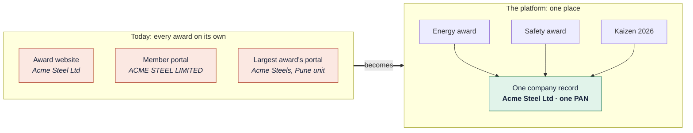
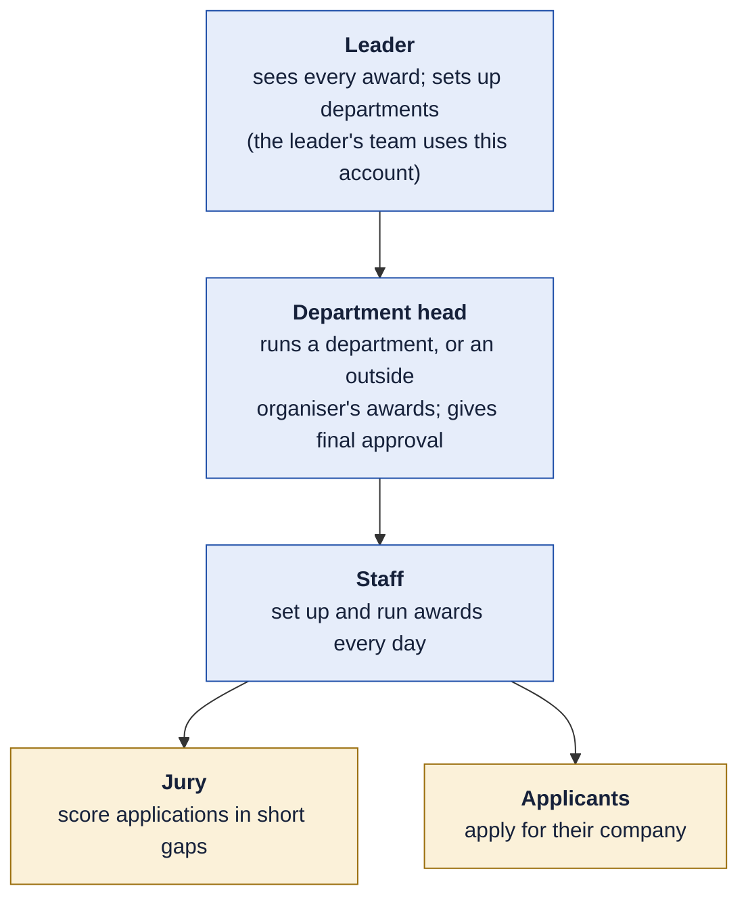
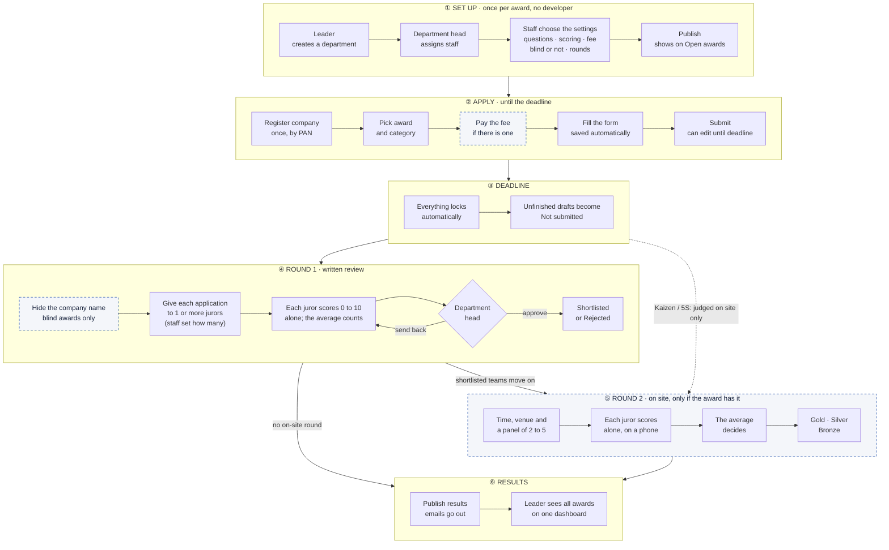
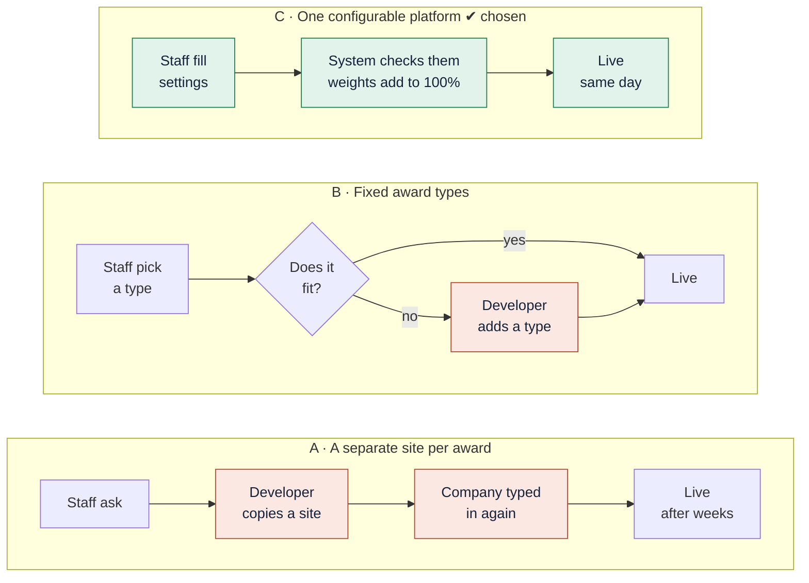
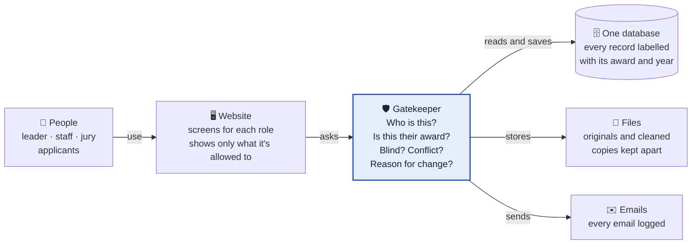

# The Awards Platform at a glance

> **One platform to run all 80 awards of an Indian industry body.**
> Takes about 5 minutes to read. You don't need any technical knowledge.
> A version of the same page that you can present on screen is [platform-flow.html](platform-flow.html) (download it and open it in any browser).

| | |
|---|---|
| **1** | [The problem](#1-the-problem) |
| **2** | [The idea](#2-the-idea) |
| **3** | [Who uses it](#3-who-uses-it) |
| **4** | [The journey of one award](#4-the-journey-of-one-award) |
| **5** | [Same journey, different awards](#5-same-journey-different-awards) |
| **6** | [The four rules](#6-the-four-rules) |
| **7** | [How we chose to build it](#7-how-we-chose-to-build-it) |
| **8** | [How the parts fit](#8-how-the-parts-fit) |
| **9** | [What each phase includes](#9-what-each-phase-includes) |
| **10** | [What it brings the organisation](#10-what-it-brings-the-organisation) |
| **11** | [Questions still open](#11-questions-still-open) |

---

## 1. The problem

The body runs about **80 awards**: business excellence, energy, safety, design, innovation, sustainability, regional awards, and shop-floor competitions such as Kaizen and 5S. Each award grew up on its own system.

| The pain today | What it costs |
|---|---|
| **A different system for each award** | Applicants, jury and staff learn a new tool every time |
| **The same company written ten ways** | Leadership can't trust a combined view. This was the biggest problem |
| **A developer for every change** | Staff can't start a new award or change its questions on their own |

The awards also work very differently. The largest scores about **250 indicators in 15 areas** over six months and two rounds. Another has **38 categories**. Some charge a fee, most don't. Shop-floor competitions are judged **live, on the shop floor**.

---

## 2. The idea

> ### An award is *settings*, not code.
> The platform does the steps that every award shares. Each award only fills in its own settings. Staff choose those settings on screen, so a new award needs **no developer**.

| Built once, shared by all 80 awards | Chosen per award by staff |
|---|---|
| Logins and roles | Questions and sections |
| One record per company, person and department | Scoring sheet and weights |
| Applying, deadlines, locking | Opening date and deadline |
| Hiding names for blind judging | Entry fee (or free), and a fee per category |
| Giving applications to jury, conflict checks | Blind judging on or off, and how many jury score each application |
| Scoring maths, approval, results, emails | Entry categories (1 or 38) |
| A history of every important change | Rounds: written review, on-site, or both |
| Checking each applicant's identity (given once, on their profile) and recent employment proof | An entry limit (e.g. 500), shown as "499 / 500" |
| The site builder: ready-made page sections | The award's own **branded site**: logo, colours, pages, photos |

---

## 3. Who uses it

| Person | Their day | What the platform gives them |
|---|---|---|
| **Applicant** | Comes once or twice a year, close to the deadline, with a long form | A branded award site that explains everything, with the places left. One company profile reused for every award. The form saves as they type. Gives a photo ID and LinkedIn link once, on their profile; uploads a recent proof of working there with each application. Can change their password |
| **Jury member** | A senior person scoring between meetings | Stop anytime and continue later. On site, they score on their phone |
| **Staff** | Works in the system every day while a cycle runs | Set up awards and build each award's branded site on screens, check applicants' proof, track progress, publish results |
| **Department head** | Owns a group of awards, or leads an **outside organiser** (e.g. the FPO Awards team) that runs its awards here on its own | Sets the brand kit, adds staff and jury, reviews the ranked results, then approves or sends them back |
| **Leader** (and the leader's team, on the same account) | Wants one view of everything | One dashboard across all awards; sets up departments and their heads |

The award always goes to the **organisation** (identified by its PAN), never to one of its plants or units. One real entry per organisation per award.

**New (7 Oct): outside organisers.** An organisation that brings its award to the platform gets its own department. The leader appoints its lead as department head, and from then on it runs its award alone (staff, jury, branded site, approvals), seeing only its own data.

---

## 4. The journey of one award

Every award follows this path. **Dotted** steps only happen when the award's settings ask for them.

---

## 5. Same journey, different awards

Three awards that look nothing alike run on the **same** journey. Only their settings differ.

| | Excellence award | Large award with a live final | Kaizen / 5S competition |
|---|:---:|:---:|:---:|
| Entry fee | Yes | Free | Free |
| Blind judging | On | Off | Off |
| Form | Long, with evidence files | Medium, many categories | Almost empty: company and team |
| ① Set up | ✅ | ✅ | ✅ |
| ② Apply | ✅ | ✅ | ✅ |
| ③ Deadline | ✅ | ✅ | ✅ |
| ④ Written review | ✅ | ✅ | — |
| ⑤ On site | — | ✅ | ✅ |
| ⑥ Results | Shortlisted / Rejected | Gold / Silver / Bronze | Gold / Silver / Bronze |
| **Code changed** | **None** | **None** | **None** |

Staff can also rename the results for each award, for example "Winner / Not selected".

---

## 6. The four rules

These come straight from the brief. The platform enforces them on every request. Hiding a button is not enough.

| | Rule | In plain words | Where in the journey |
|:---:|---|---|:---:|
| 🔒 | **1. Blind judging** | In a blind award, jury only see a cleaned copy, never the company's name or original files | ④ |
| 🚫 | **2. Conflict of interest** | Staff record "this juror knows this company" once; the system then refuses that pairing in every award | ④ ⑤ |
| 📝 | **3. Score history** | After a juror submits, any change needs a reason. Who, when, old score and new score are kept. Approved scores never change | ④ ⑤ |
| 📁 | **4. Changing questions** | Each published set of questions is saved for good. Last year's applications always open with last year's questions | ① ② |

---

## 7. How we chose to build it

The test question: **what happens when the organisation wants to start award number 81?**

The red boxes are where a developer or a second copy of the data comes in. Option C has neither.

| | A · Site per award | B · Fixed types | C · Configurable ✔ |
|---|:---:|:---:|:---:|
| New award without a developer | ❌ | ⚠️ only if it fits | ✅ |
| One clean set of company data | ❌ | ✅ | ✅ |
| One view for the leader | ❌ | ✅ | ✅ |
| Fast to build the first award | ✅ | ✅ | ⚠️ slower start |
| Handles Kaizen and the 250-indicator award alike | ⚠️ each by hand | ⚠️ two types | ✅ |

**Why C:** it is the only option where staff set the differences without code, and it also fixes the data problem.
**What would change our mind:** if almost all awards followed two or three fixed patterns, B would be cheaper. They don't.

Smaller choices made the same way:

| Question | Turned down | Chosen |
|---|---|---|
| Keep awards apart | A separate database per award | One database. Every record is labelled with its award and year, and one gatekeeper checks who sees what |
| Shop-floor competitions | A special Kaizen flow written in code | A general "on-site round" that any award can switch on |
| Questions change mid-year | Edit the form in place | Save a frozen copy at every change |
| Conflicts of interest | Guess them automatically | Staff record what they know, and the system enforces it |
| On-site scoring | Paper sheets typed in later | Phones, with staff typing in a paper sheet only as a backup |

---

## 8. How the parts fit

- **Every request passes through the gatekeeper.** No screen can go around it, so the four rules always hold.
- **Each award's settings live in the database as data.** That is why staff can change them without a developer.
- **Awards share the database but not each other's data.** Every record carries its award and year, and people only see the awards they belong to.

---

## 9. What each phase includes

The platform is delivered in three phases ([the full plan](../PLAN.md)). **Phase 1 (10–15 Oct)** is the working platform; the rest builds on it.

| Phase 1 · working platform, online | Phase 2 · complete product (~20 days) | Phase 3 · launch-ready (~15 days) |
|---|---|---|
| Two different awards set up on screen, with no code | On-site rounds and Gold / Silver / Bronze | Security and privacy reviews |
| Questions saved as frozen versions; scoring sheet with weights | The full site builder (sections, versions) | Load testing for deadline nights |
| Apply, autosave, submit, withdraw; one application per company | The leader's admin screens | A real payment gateway |
| Photo ID and LinkedIn once on the profile; recent employment proof | External organisers' dashboard | Own web addresses (fpoawards.in) |
| Entry limit with a public counter; a branded page per award | Every email, sent for real | Backups, monitoring, accessibility |
| Blind copies, conflict checks, several jury and the average | Disqualify, reinstate, deadline extension | Client testing |
| Approval, results, the leader's dashboard | Robot tests of every journey | |

**Not planned:** importing past years' data, finding names inside PDFs automatically, member-portal login, offline scoring, a mobile app, other languages.

**Extras added beyond the brief:** data that cleans itself as it's saved (one spelling, one PAN), company details hidden from jury automatically, a snapshot of the company at the time it applied, "New / Updated" markers on changed questions, autosave everywhere, one application per company (a second one can't even be started), weights that must add up to 100%, nothing ever deleted, staff backup for on-site scoring, renamable result names.

---

## 10. What it brings the organisation

| | |
|---|---|
| 🚀 **Staff launch awards themselves** | A new award or a new year is set up on screen the same day, with no developer cost |
| 📊 **One picture you can trust** | One record per company. The leader can finally compare all 80 awards |
| ⚖️ **Results you can defend** | Blind judging, conflict checks and score history make every result explainable, which protects the awards' reputation |
| ⏱️ **Less manual work** | Deadlines lock, scores add up, medals are suggested and emails send by themselves |
| 🤝 **A better experience** | One login and one company profile for every award, and work is never lost |
| 📈 **Room to grow** | About 40,000 applications a year (80 awards × 300–500 each) fits comfortably |

**Honest limits:** if staff miss a name hidden inside a PDF, the system can't spot it. A conflict nobody recorded can't be blocked. On-site scoring needs internet. A brand-new kind of step, such as a site visit, would need new work.

---

## 11. Questions still open

Each question has a default that we build until it is answered.

| # | Question | Default |
|:---:|---|---|
| 1 | In a written-review-only award, does the winner see "Shortlisted" or "Winner"? | Shortlisted, renamable |
| 2 | Should past years' data be brought in later? | No, history starts on the platform |
| 3 | When should award sites get their own domain (fpo.platform.in, then fpoawards.in)? | After the first release |
| 4 | Can a department head edit scores? | No, only approve or send back |
| 5 | One leader only, or a backup leader? | One |
| 6 | Must an applicant resubmit when a question is added? | No, they are flagged "update requested" |
| 7 | Weights: per section first, then per indicator inside it? | Yes |
| 8 | Can an applicant withdraw after the deadline? | No |

---

More detail: the full spec is [docs/requirements.md](../requirements.md), the plan is [docs/PHASES.md](../PHASES.md), open items are in [docs/GAPS.md](../GAPS.md), and decisions with their reasons are in [docs/decisions/](../decisions/).
