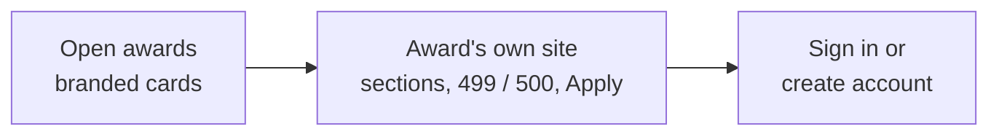
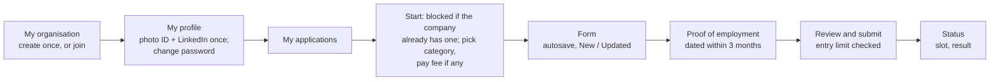
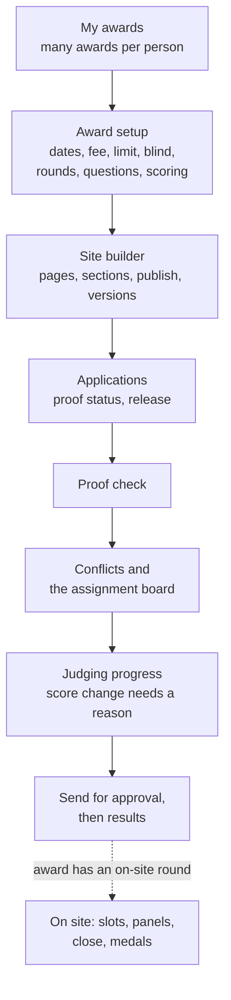
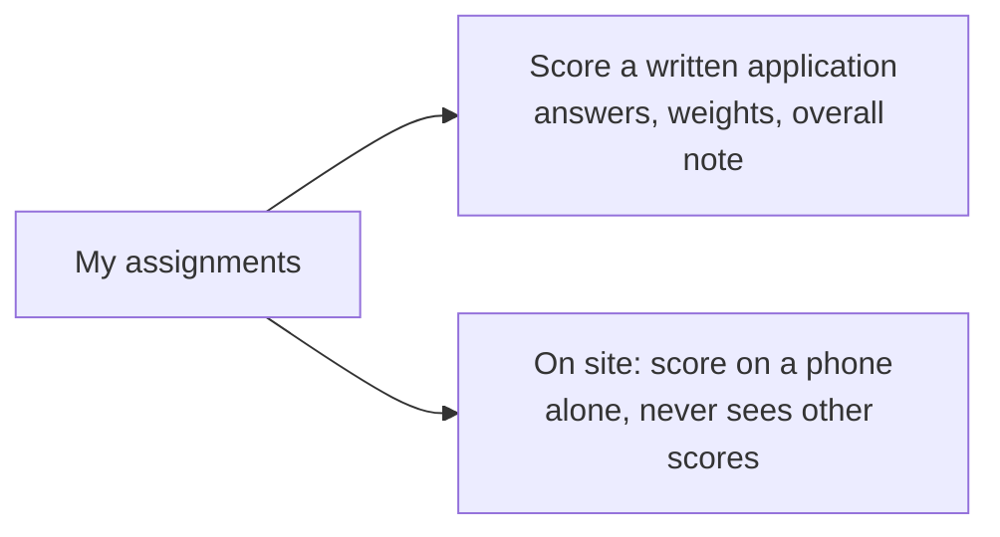
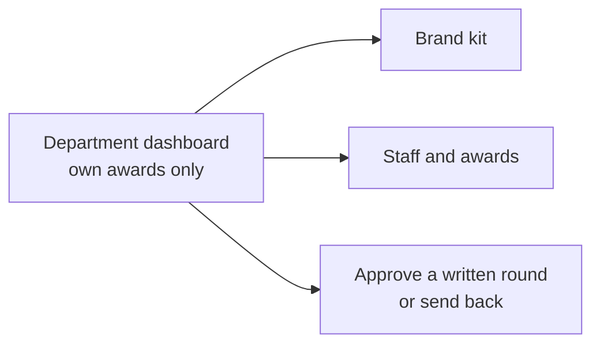
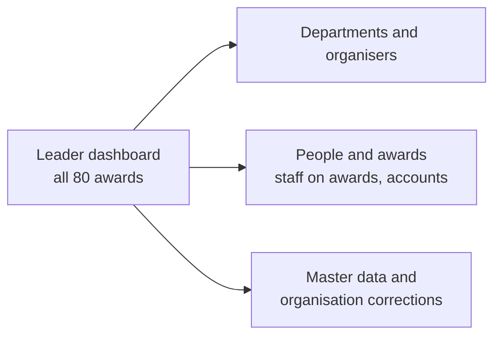

# UI overview: how the platform looks and flows

> **What this is.** The client asked to see the platform before anything is built. This folder shows every user's journey **screen by screen**. It's a prototype of the flow: no real data, nothing is saved, and the final visual design will differ.
>
> **Phase 0.5** · 8 Oct 2026, updated 9 Oct (Phase 0.7: proof once on the profile, My profile, several jury per application) · Related: [the plan](../PLAN.md) · [the spec](../requirements.md) · [re-plan options](../proposals/0.5-replan-options.md)

## How to open it

| File | What it is | How to open |
|---|---|---|
| [prototype.html](prototype.html) | **Clickable prototype**: 32 screens across 6 roles | Download the file (GitHub's "Download raw file" button) and open it in Chrome or Edge. Pick a role at the top, then use **Next →** or the arrow keys |
| [brand-value.html](brand-value.html) | **How we keep the organiser's brand**: 3 pages and a live site-builder demo | The same way |
| This page | The flows as diagrams, readable right here on GitHub | Scroll down |

Each prototype screen has yellow notes (which decision it shows) and red notes (which of the four rules it enforces).

---

## The whole journey of one award

```mermaid
flowchart LR
    A["Leader<br/>creates a department<br/>and its head"] --> B["Department head<br/>adds staff and jury<br/>(temporary passwords)"]
    B --> C["Staff<br/>set up the award<br/>and build its site"]
    C --> D["Applicants<br/>find the site, apply,<br/>upload proof"]
    D --> E["Staff<br/>check proof, assign each<br/>application to listed jury"]
    E --> F["Jury<br/>score alone;<br/>the average counts"]
    F --> G["Department head<br/>approves<br/>(written rounds)"]
    G --> H["Staff<br/>publish results"]
    H -.->|if the award has an on-site round| I["Panel scores<br/>on site"]
    I -.-> H
```

---

## 1. Visitor

| # | Screen | Shows | Prototype |
|---|---|---|---|
| 1 | Open awards | Each award as a card in its organiser's brand, with deadline and places left | `prototype.html#v-open` |
| 2 | Award's branded site | Built by staff from sections; deadline, places left, categories and past winners are filled automatically | `#v-site` |
| 3 | Sign in / register | One account per email, for every award and role | `#v-login` |

## 2. Applicant

| # | Screen | Shows | Prototype |
|---|---|---|---|
| 1 | My organisation | **Create** it once (first person from the company; PAN / GSTIN checks, values cleaned on save) or **Join** it (PAN + GSTIN, or PAN + official email); a PAN that already exists sends you to Join | `#a-org` |
| 2 | My profile | Photo ID (masked Aadhaar only) and LinkedIn link **once**, reused for every award; name, phone and **change password** (every role has this page) | `#a-profile` |
| 3 | My applications | Friendly statuses; a colleague's application read-only, without their name | `#a-apps` |
| 4 | Start and pay | Blocked if the organisation already has an application (status only); category fee; demo payment | `#a-start` |
| 5 | Application form | Sections, progress, autosave, New / Updated markers (R4) | `#a-form` |
| 6 | Proof of employment | The ID and LinkedIn come from the profile; only a proof of employment dated within 3 months is uploaded; consent | `#a-proof` |
| 7 | Review and submit | Checklist; "499 / 500"; the 501st is refused | `#a-submit` |
| 8 | Status | Submitted → proof verified → shortlisted → presentation slot → medal | `#a-status` |

## 3. Staff

| # | Screen | Shows | Prototype |
|---|---|---|---|
| 1 | My awards | Awards across departments | `#s-awards` |
| 2 | Award setup | Every difference between awards, set on screen; publish blocked until valid (R4) | `#s-setup` |
| 3 | Site builder | Pages, sections, layouts, preview, publish, restore | `#s-site` |
| 4 | Applications | Filters; proof status; release a wrong application with a reason | `#s-apps` |
| 5 | Proof check | The profile's ID and LinkedIn next to this application's dated employment proof; Verified, or Rejected with a reason (each award checks its own) | `#s-proof` |
| 6 | ~~Masking~~ | *Dropped on 11 Oct (ADR 0018): blind awards hide identity and files automatically. The prototype screen is kept for the record* | `#s-mask` |
| 7 | Jury and assignment | Recorded conflicts (R2); **jury per application** (minimum and maximum); assign by hand from the department's jury list; the board with counts per application and per juror; "needs more jury" | `#s-assign` |
| 8 | Judging progress | Each jury member's score and the average; score correction with a reason, kept in history (R3) | `#s-judging` |
| 9 | Results | After approval: ranked list, Shortlisted / Rejected, publish | `#s-results` |
| 10 | On-site round | Slots, panels, staff backup entry, close, suggested medals | `#s-onsite` |

## 4. Jury

| # | Screen | Shows | Prototype |
|---|---|---|---|
| 1 | My assignments | Only their own applications and progress | `#j-list` |
| 2 | Scoring (written, blind) | The answers as typed; no identity, no files, no proof documents, no total, never another jury member's marks (R1) | `#j-score` |
| 3 | On-site scoring | Phone screen; panel member scores alone | `#j-onsite` |

## 5. Department head (or an external organiser's lead)

| # | Screen | Shows | Prototype |
|---|---|---|---|
| 1 | Department dashboard | An organiser running its awards on its own | `#h-dash` |
| 2 | Brand kit | Logo, colours (readability checked), font, links, live preview | `#h-brand` |
| 3 | Staff and awards | Invite staff, give them awards | `#h-staff` |
| 4 | Approve a round | Ranked list by average, each jury member's score and note, disqualified list; approve locks scores (R3) | `#h-review` |

## 6. Leader (the leader's team uses the same account)

| # | Screen | Shows | Prototype |
|---|---|---|---|
| 1 | Leader dashboard | One view across every award and department | `#l-dash` |
| 2 | Departments | Create a department for an external organiser and appoint its head | `#l-depts` |
| 3 | People and awards | Find a person; assign staff to awards; resend invites; deactivate accounts; the leader's recent changes | `#l-people` |
| 4 | Master data | Shared lists (retire, never delete); organisation corrections with a reason | `#l-master` |

---

## What the prototype doesn't show

- Final colours, fonts and illustrations (the look here is deliberately simple).
- Emails (listed in [spec §5.13](../requirements.md)), error states and empty states.
- Every edge case: it shows the main path of each journey.
